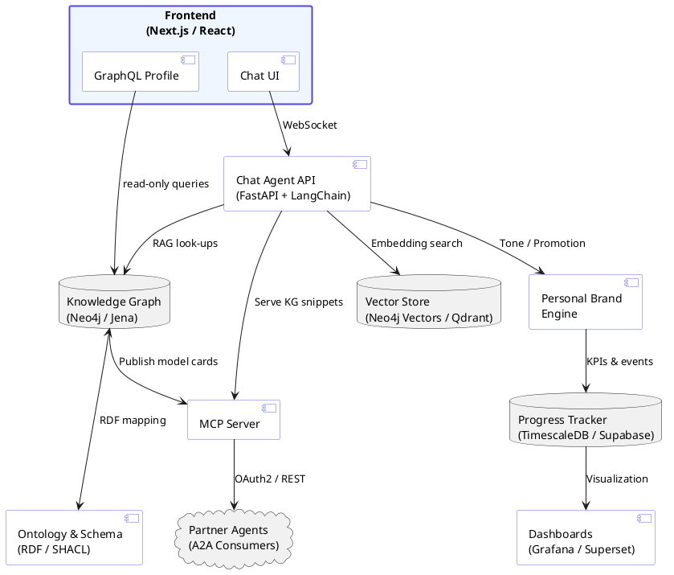

1 · North‑Star Vision

Build a Personal Job‑Enhancement System (PJES) that
	•	Internally acts as an always‑on AI career coach/mentor, tracking your goals, surfacing blind spots, and recommending daily micro‑actions.
	•	Externally showcases your expertise through a dynamic public site, a conversational agent, and open interfaces (A2A, MCP) so that recruiters, collaborators, or automated agents can discover, query, and integrate your profile.
	•	Evolves in continuous‑delivery style—each phase is a usable product that demonstrates your leadership in applied AI.

⸻

2 · Target Outcomes

Dimension	Success Indicator
Career growth	Measurable skills acquisition, new publications, conference talks, and role elevation within 12 months.
Visibility	≥ 500 monthly visitors to the personal site, ≥ 50 inbound inquiries/year via A2A or chat.
Demonstrated expertise	Public code, blog posts, and live demos that peers cite as reference implementations.
AI practice	Automated tracking of learning hours, project commits, and knowledge‑graph enrichment with ≤ 24 h lag.

⸻

3 · High‑Level Architecture

⸻

4 · Implementation Roadmap

Phase	Duration	Deliverables	Value Unlocked
0 · Foundation	2 w	• Domain, basic Next.js site • GitHub mono‑repo scaffold • Terraform skeleton (dev/prod)	Public landing page + infra
1 · MVP Coach	4 w	• CLI/Slack bot for goals & weekly sprints • Local vector store of past chats & CV	Productivity boost; demo internal AI
2 · Public Profile + Static KG	3 w	• Auto‑generated site from YAML/Markdown • GraphQL endpoint	SEO résumé; sharable API
3 · Interactive Chat Agent	4 w	• WebSocket chat UI • RAG pipeline over KG • Promotion steering	Recruiter engagement
4 · Dynamic Knowledge Graph	5 w	• Continuous ingestion (GitHub, LinkedIn, RSS) • Embeddings & tags	Up‑to‑date, machine‑readable portfolio
5 · A2A & MCP Services	4 w	• OAuth2 flow • REST/GraphQL endpoints	Ecosystem integrations
6 · Progress Analytics & Gamification	3 w	• KPI dashboards • Auto‑publishing badges	Social proof & discipline
7 · Hardening & FinOps	ongoing	• Load tests, security scans, cost dashboards	Sustainable operations
8 · Community & Open‑Source Release	2 w	• Publish templates • Launch article	Thought‑leadership

Total roadmap: ~27 weeks part‑time.

⸻

5 · Gap Analysis

Area	Current Strength	Gap	Mitigation
Full‑stack branding	Strong backend & infra	Need polished UI/UX & storytelling	Partner with designer; refine writing
Semantic web	Graph schema know‑how	Deep SHACL & Linked‑Data patterns	15 h focused study + Phase 4 practice
A2A & MCP security	Conceptual	Production‑grade auth + versioning	Review specs; pen‑test in Phase 7
Content cadence	Ad‑hoc blogging	Consistent weekly output	Use PJES coach reminders

⸻

6 · 12‑Month Personal Development Plan (≈ 1 h/day)

Quarter	Focus	Weekly Cadence	Milestones
Q2 2025	Knowledge Graph Engineering	Mon course; Wed schema build	Blog “Building my career KG”
Q3 2025	LLM Orchestration & Eval	Tue/Thu model experiments	Submit GraphConnect CFP
Q4 2025	Agentic Protocols & Security	Wed MCP deep‑dive; Sat OAuth labs	OSS MCP plugin ≥ 100 ★
Q1 2026	Thought Leadership	Fri newsletter; Sun 5‑min video	Host invite‑only workshop

Tracking via IDE plugin → Progress Tracker → Grafana.

⸻

7 · Questions / Assumptions to Confirm
	1.	Do you already have a brand logo / color palette we must follow?
	2.	Which KG data fields should remain private (e.g., salary history)?
	3.	Monthly cloud‑cost ceiling for FinOps guardrails?
	4.	Public chat: Open‑source models only or also GPT‑4o?
	5.	Employer policies on public OSS contributions?
	6.	OK to use third‑party analytics (Plausible/GA) or self‑host only?
	7.	Interest in a community space (Discord/Slack) in addition to A2A?

⸻

Next Step

Confirm the open questions and we’ll turn Phase 0 into actionable GitHub tickets this week.
